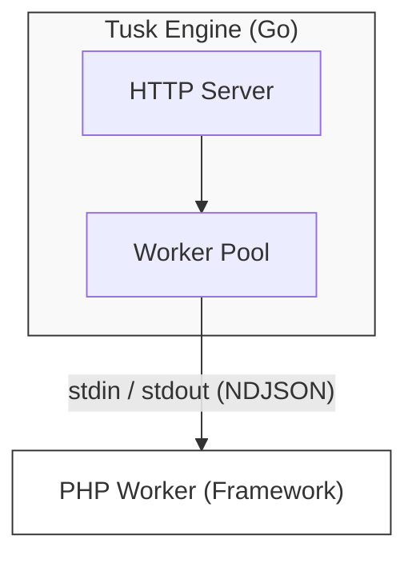

# Tusk Native Engine (v0.1)

The **Tusk Native Engine** is the high-performance, all-in-one application server for the Tusk Framework. It replaces `php-fpm` and `nginx` with a single, self-contained binary written in Go.

## Features

- **High Performance**: Uses Go's `net/http` for event-driven networking and standard I/O pipes for communicating with PHP workers.
- **Portable**: Can download and manage its own PHP runtime (Sidecar mode), requiring zero system dependencies.
- **All-in-One Tool**: Like Bun for Node.js, tusk manages your entire PHP project with a unified CLI.
- **Dual Config Support**: Works with both `tusk.json` and standard `composer.json` - use whichever you prefer!
- **Package Management**: Built-in commands to manage PHP dependencies without needing to invoke composer directly.
- **Unified CLI**: The `tusk` binary handles server management, dependency management, and framework commands.
- **Dynamic Config**: Automatically loads settings from `tusk.json` or `composer.json`.
- **Process Management**: Automatically supervises PHP workers, restarting them if they crash.

## Architecture



## Installation

### Windows (PowerShell)
```powershell
iwr -useb https://tusk.sh/install.ps1 | iex
```

### Ubuntu / macOS (Bash)
```bash
curl -fsSL https://tusk.sh/install.sh | bash
```

> [!NOTE]
> The installers above will download the Tusk binary and a portable PHP runtime into `~/.tusk` (or `%USERPROFILE%\.tusk`) and add them to your PATH.

## Manual Build
```bash
go build -o tusk ./cmd/tusk
```

## Quick Start

### 1. Initialize Your Project
```bash
# Create a new tusk.json file
tusk init

# Or use your existing composer.json - tusk reads both!
```

### 2. Configure (Optional)
Create or edit `tusk.json` in your project root:
```json
{
    "port": 8080,
    "worker_count": 4,
    "php_binary": "php",
    "worker_command": "worker.php",
    "scripts": {
        "dev": "php -S localhost:8000",
        "test": "phpunit"
    }
}
```

**Or use composer.json** - tusk automatically reads scripts and configuration:
```json
{
    "name": "my/project",
    "require": {
        "php": "^8.0"
    },
    "scripts": {
        "dev": "php -S localhost:8000",
        "test": "phpunit"
    }
}
```

> [!NOTE]
> If both `tusk.json` and `composer.json` exist, tusk.json takes priority but scripts from both are merged.

### 3. Manage Dependencies
```bash
# Install dependencies
tusk install

# Add a package
tusk add symfony/console

# Remove a package
tusk remove symfony/console

# Update dependencies
tusk update
```

### 4. Run Scripts
```bash
# Run any script defined in tusk.json or composer.json
tusk dev
tusk test

# Scripts from both config files work seamlessly
```

### 5. Start the Server
```bash
# Use default worker.php
tusk start

# Or specify a custom worker file
tusk start custom-worker.php
```

> [!TIP]
> You can customize the worker file in two ways:
> 1. **Command-line**: `tusk start my-worker.php` (takes precedence)
> 2. **Config file**: Set `"worker_command": "my-worker.php"` in `tusk.json`

## All-in-One Package Management

Tusk is designed to be like **Bun for PHP** - a comprehensive tool that manages your entire project:

### 🔄 Automatic Config Detection
- Reads from `tusk.json` (custom Tusk config)
- Falls back to `composer.json` (standard PHP)
- Merges scripts from both if both exist
- Priority: `tusk.json` > `composer.json`

### 📦 Built-in Dependency Management
No need to switch between `tusk` and `composer` commands:

```bash
tusk install              # Install all dependencies
tusk add vendor/package   # Add a new package
tusk remove vendor/package # Remove a package
tusk update               # Update all dependencies
tusk update vendor/package # Update specific package
```

### 🚀 Script Runner
Run any script from `tusk.json` or `composer.json`:

```bash
tusk dev    # Run your dev script
tusk test   # Run your test script
tusk build  # Run your build script
```

### 🎯 Unified Interface
Everything through one command:
- Server management: `tusk start`
- Package management: `tusk install`, `tusk add`, `tusk update`
- Script execution: `tusk <script-name>`
- Framework commands: `tusk make:controller` (proxied to PHP)

## Protocol (NDJSON)
The engine communicates with PHP workers using Newline Delimited JSON.
- **Request**: `{ "method": "GET", "url": "/", "headers": {...}, "body": "..." }`
- **Response**: `{ "status": 200, "headers": {...}, "body": "..." }`
