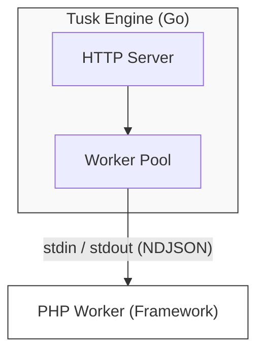

# Tusk Native Engine (v0.1)

The **Tusk Native Engine** is the high-performance application server for the Tusk Framework. It replaces `php-fpm` and `nginx` with a single, self-contained binary written in Go.

## Features

- **High Performance**: Uses Go's `net/http` for event-driven networking and standard I/O pipes for communicating with PHP workers.
- **Portable**: Can download and manage its own PHP runtime (Sidecar mode), requiring zero system dependencies.
- **Unified CLI**: The `tusk` binary handles both server management (`tusk start`) and framework commands (`tusk make:controller`), acting as a transparent proxy.
- **Dynamic Config**: Automatically loads settings from `tusk.json` (Port, Worker Count, PHP Path).
- **Process Management**: Automatically supervises PHP workers, restarting them if they crash.

## Architecture



## Installation

### Windows (PowerShell)
```powershell
iwr -useb https://tusk.sh/install.ps1 | iex
```

### Ubuntu / macOS (Bash)
```bash
curl -fsSL https://tusk.sh/install.sh | bash
```

> [!NOTE]
> The installers above will download the Tusk binary and a portable PHP runtime into `~/.tusk` (or `%USERPROFILE%\.tusk`) and add them to your PATH.

## Manual Build
```bash
go build -o tusk ./cmd/tusk
```

### 2. Configure (Optional)
Create a `tusk.json` in your project root:
```json
{
    "port": 8080,
    "worker_count": 4,
    "php_binary": "php",
    "worker_command": "worker.php"
}
```

### 3. Run
```bash
# Use default worker.php
./tusk start

# Or specify a custom worker file
./tusk start custom-worker.php
```

> [!TIP]
> You can customize the worker file in two ways:
> 1. **Command-line**: `tusk start my-worker.php` (takes precedence)
> 2. **Config file**: Set `"worker_command": "my-worker.php"` in `tusk.json`

## Protocol (NDJSON)
The engine communicates with PHP workers using Newline Delimited JSON.
- **Request**: `{ "method": "GET", "url": "/", "headers": {...}, "body": "..." }`
- **Response**: `{ "status": 200, "headers": {...}, "body": "..." }`
