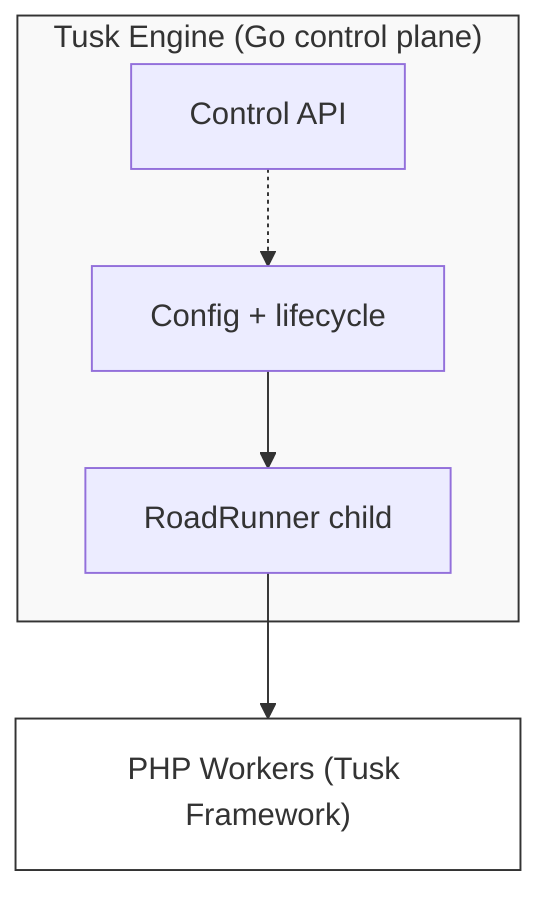

# Tusk Engine

The **Tusk Engine** is the Go control plane for the Tusk Framework and its RoadRunner runtime. It owns project configuration, RoadRunner lifecycle, readiness, diagnostics, and platform operations. RoadRunner owns HTTP, PHP workers, IPC, pooling, recycling, and request limits.

RoadRunner is the sole Engine request data plane. The Engine owns lifecycle,
readiness, diagnostics, and control APIs around that runtime.

[Contributing](CONTRIBUTING.md) · [Code of Conduct](CODE_OF_CONDUCT.md) ·
[Security](SECURITY.md)

## Features

- **Runtime Control**: Validates, starts, monitors, reloads, and stops RoadRunner without duplicating its worker pool.
- **Portable**: Manages the configured RoadRunner/PHP process boundary across supported development and deployment environments.
- **Unified CLI**: Provides project, lifecycle, diagnostics, and platform commands above the runtime.
- **Configuration boundaries**: `tusk.json` sets platform options; `composer.json` owns dependencies and scripts; `config/*.php` holds application settings.
- **Package Management**: Composer-backed convenience commands; Composer remains the dependency resolver and lockfile authority.
- **Project CLI**: The `tusk` binary handles project management, dependency commands, diagnostics, and framework commands.
- **Offline documentation**: [`tusk docs`](docs/user-guide/index.md) lists the version-matched guides embedded in the Engine binary; the linked Markdown is their canonical source.
- **Project bootstrap**: Requires an application returned from `bootstrap/app.php`; the Engine generates the RoadRunner worker.
- **Process Management**: Supervises the RoadRunner process and reports runtime failures.
- **Control API**: Optional, versioned health, readiness, metadata, and Prometheus endpoints for local operations.
- **Component model**: Activates versioned, replaceable service-invocation and resilience providers before serving traffic.

## Architecture


```mermaid
graph TD
    subgraph Engine ["Tusk Engine (Go control plane)"]
        Config["Config + lifecycle"] --> RR["RoadRunner child"]
        Control["Control API"] -.-> Config
    end

    RR --> Worker["PHP Workers (Tusk Framework)"]
    
    style Engine fill:#f9f9f9,stroke:#333,stroke-width:1px
    style Worker fill:#fff,stroke:#333,stroke-width:1px
```

## Installation

Download the latest binary for your platform from the [GitHub Releases](https://github.com/tusk-framework/tusk-engine/releases) page.

### Windows (PowerShell)
```powershell
# Download the latest release
$url = "https://github.com/tusk-framework/tusk-engine/releases/latest/download/tusk_Windows_x86_64.zip"
Invoke-WebRequest -Uri $url -OutFile tusk.zip
Expand-Archive tusk.zip -DestinationPath "$env:USERPROFILE\.tusk"

# Add to PATH (run once)
$env:PATH += ";$env:USERPROFILE\.tusk"
[Environment]::SetEnvironmentVariable("PATH", $env:PATH, "User")
```

### Ubuntu / macOS (Bash)
```bash
# Download the latest release
# Linux amd64:
curl -L https://github.com/tusk-framework/tusk-engine/releases/latest/download/tusk_Linux_x86_64.tar.gz | tar xz
# macOS Apple Silicon:
# curl -L https://github.com/tusk-framework/tusk-engine/releases/latest/download/tusk_Darwin_arm64.tar.gz | tar xz

mkdir -p ~/.tusk && mv tusk ~/.tusk/tusk

# Add to PATH (add to ~/.bashrc or ~/.zshrc)
export PATH="$HOME/.tusk:$PATH"
```

> [!NOTE]
> After installation, restart your terminal (or run `source ~/.bashrc`) to ensure `tusk` is available on your PATH.

## Contributing and releases

See [CONTRIBUTING.md](CONTRIBUTING.md) for the development environment,
project boundaries, test commands, Conventional Commits, and pull request
expectations. Community participation follows the [Code of Conduct](CODE_OF_CONDUCT.md).

Engine releases are published from versioned Git tags after the required CI
checks pass. Catalog signing credentials remain in GitHub Actions secrets and
public trust anchors remain repository variables; private signing material is
never committed to this repository.

## Manual Build
```bash
go build -o tusk ./cmd/tusk
```

## Quick Start

### 1. Initialize Your Project
```bash
# Create a tusk.json file for platform settings
tusk init
```

`tusk init` creates `tusk.json` only. Use a modern Tusk application skeleton,
or add `bootstrap/app.php` and the application files before starting. The
bootstrap must return a configured `Tusk\Foundation\Application`; it must not
start a server. Install PHP dependencies with `composer install` or
`tusk install`, and ensure PHP and RoadRunner are available. See the
[project runtime guide](docs/guides/project-runtime.md) for file ownership and
the modern runtime contract.

### 2. Configure (Optional)
Create or edit `tusk.json` in your project root:
```json
{
    "port": 8080,
    "worker_count": 4,
    "php_binary": "php",
    "timeout": 30,
    "max_body_bytes": 10485760,
    "runtime": {
        "status_address": "127.0.0.1:2114",
        "rpc_address": "tcp://127.0.0.1:6001",
        "startup_timeout": 30000000000,
        "probe_interval": 250000000
    },
    "control": {
        "enabled": false,
        "address": "127.0.0.1",
        "port": 9091
    },
    "scripts": {
        "dev": "tusk start",
        "test": "phpunit"
    }
}
```

Requests above the configured body limit are rejected by RoadRunner with HTTP
413. Static files and application routing remain application concerns. Scripts
from `tusk.json` override scripts with the same name from `composer.json`,
while non-conflicting scripts are merged.

### Component model

The Engine validates and activates configured components before starting
RoadRunner or the control server. Add component settings under
`"components"` in `tusk.json`; invalid names, fields, types, provider
configuration, or startup health checks fail before traffic is served. The
default registry provides the transport-free
`in-process-service-invocation` contract and the bounded
`default-resilience` provider. See [docs/components.md](docs/components.md)
for configuration, idempotency, retry, deadline, circuit-breaker, metadata,
and provider-substitution guidance.

### Toolchain diagnosis

The Engine can inspect the exact PHP, Composer, and RoadRunner executables
available to the project without changing the machine:

```bash
tusk doctor
tusk doctor --json
tusk toolchain list
tusk toolchain pin php@8.3
tusk setup --toolchain --offline
tusk docs
tusk docs runtime
```

When `.tusk/toolchain.json` declares a relative executable path, the project
binary takes precedence over `PATH`. `tusk setup --toolchain` is the only
command that provisions tools: it loads the signed catalog at
`.tusk/toolchain.catalog.json`, installs only pinned tools without explicit
paths, and records managed paths only after verified installation. Add
`--offline` to require a digest-checked cache hit; missing, unsigned, or
expired catalogs fail before download. No executable is silently replaced and
the global `PATH` is never changed.

Release operators must follow the [official catalog release
runbook](release/README.md) for payload review, environment-only signing,
provenance, key rotation, and revocation. The checked-in payload is signing
input only; it is not a trusted runtime catalog.

**Use composer.json for Composer-managed project data** - tusk reads Composer
dependencies, metadata, and scripts from it. Application settings remain in
`config/*.php`, while platform settings remain in `tusk.json`:
```json
{
    "name": "my/project",
    "require": {
        "php": "^8.0"
    },
    "scripts": {
        "dev": "tusk start",
        "test": "phpunit"
    }
}
```

> [!NOTE]
> `tusk.json` controls Engine/platform settings; `composer.json` controls dependencies and lockfiles. Scripts from both are merged, with `tusk.json` winning name conflicts. Application configuration belongs under `config/*.php`; `config.php` is not a special runtime filename.

### Control API

The control API is disabled by default and does not change the public traffic server. Enable it explicitly for local health checks and observability:

```json
{
    "control": {
        "enabled": true,
        "address": "127.0.0.1",
        "port": 9091,
        "metrics_path": "/v1/metrics"
    },
    "runtime": {
        "metrics_address": "127.0.0.1:2112"
    }
}
```

When enabled, the engine exposes:

- `GET /v1/healthz` — process health; returns `200` during startup and graceful shutdown.
- `GET /v1/readyz` — RoadRunner readiness; returns `200` only after its status plugin reports an HTTP worker ready.
- `GET /v1/metadata` — safe engine and runtime metadata.
- `GET /v1/metrics` — authenticated composition of Engine and RoadRunner Prometheus metrics.

The default loopback binding does not require a token. If `address` is non-loopback, configure a non-empty `token`; every control endpoint then requires `Authorization: Bearer <token>`. Do not expose the control API publicly without a network policy and secret management appropriate for your deployment.

RoadRunner's Prometheus listener is internal and loopback-only at
`http://127.0.0.1:2112/metrics` by default. Tusk renders RoadRunner's
`http_metrics` middleware, which supplies bounded method/status/duration request
metrics plus worker state and queue-depth metrics, then composes that scrape
behind the authenticated Control API. The runtime metrics listener rejects
non-loopback addresses; use the Control API or an authenticated monitoring
gateway/local scrape agent when metrics must be collected remotely. The
Control API and its metrics route are disabled by default.

RoadRunner remains the source of truth for worker lifecycle, queue, and request
metrics. The Engine exposes its RoadRunner lifecycle and scrape-availability
metrics through the control registry.

### Engine components

The Engine activates its versioned component registry before the control plane
or RoadRunner starts. Configure validated, transport-free providers under the
`components` object in `tusk.json`; see [Engine components](docs/components.md)
for the default service-invocation and resilience providers, bounded retry and
idempotency rules, provider substitution, and safe metadata behavior.

### 3. Manage Dependencies with Composer
```bash
# Install dependencies
tusk install

# Add a package
tusk add symfony/console

# Remove a package
tusk remove symfony/console

# Update dependencies
tusk update
```

### 4. Run Scripts
```bash
# Run any script defined in tusk.json or composer.json

# Explicit way (recommended for clarity)
tusk run dev
tusk run test

# Shorthand (backward compatible)
tusk dev
tusk test

# Scripts from both config files work seamlessly
```

> [!TIP]
> Use `tusk run <script>` for explicit script execution, or just `tusk <script>` as shorthand.
> Both work the same way, but `tusk run` makes it clear you're running a script.

### 5. Start RoadRunner
```bash
# Run from the project root after installing dependencies
tusk start
```

> [!TIP]
> `tusk start` requires `bootstrap/app.php`. The Engine creates `.tusk/runtime/worker.php` and a private RoadRunner configuration, then starts `rr serve` with `php .tusk/runtime/worker.php`. It waits for `/ready?plugin=http` and shuts RoadRunner down gracefully. Status and RPC sockets are loopback-only by default. Missing RoadRunner or failed readiness is an error.

Projects must provide the modern application contract: `bootstrap/app.php`,
application-owned configuration and routes, and Composer dependencies. Review
the bootstrap composition before running `tusk start`.

## Why Use Tusk with RoadRunner?

Tusk's RoadRunner control plane preserves the persistent PHP model while giving the runtime a single owner for HTTP and worker supervision:

### ⚡ Performance & Features
- **Stateful Workers**: Unlike `php -S` which creates a new process per request, RoadRunner maintains a pool of long-running PHP workers
- **State Management**: Workers keep state between requests - perfect for caching, connection pooling, and performance
- **Auto-Restart**: RoadRunner recycles workers according to its limits and supervision policy
- **Concurrent Requests**: RoadRunner handles the worker pool and concurrency
- **Production-Ready**: The same lifecycle contract is used in development and production

### 📝 Use Tusk Server in Scripts
Use `tusk start` or `tusk dev` to launch the managed RoadRunner runtime:

```json
{
  "scripts": {
    "dev": "tusk start"
  }
}
```

The `tusk dev` command is an alias for `tusk start`.

## Composer-backed Package Commands

Tusk provides a unified CLI around the PHP runtime while keeping Composer as the source of truth for dependency resolution:

### Configuration boundaries
- `tusk.json` contains Engine and platform settings such as ports, runtime limits, and RoadRunner controls.
- `config/*.php` contains application settings such as database, cache, and application services.
- `composer.json` provides Composer metadata, dependency declarations, autoloading, and scripts. Composer remains responsible for dependency resolution and the lockfile.
- Tusk does not treat `composer.json` as the source of application or platform configuration.

### 📦 Composer-backed Dependency Commands
These convenience commands delegate dependency work to Composer. Composer
remains the dependency solver and `composer.lock` authority; setup may provide
the Composer PHAR and its resolved PHP interpreter:

```bash
tusk install              # Install all dependencies
tusk add vendor/package   # Add a new package
tusk remove vendor/package # Remove a package
tusk update               # Update all dependencies
tusk update vendor/package # Update specific package
```

### 🚀 Script Runner
Run any script from `tusk.json` or `composer.json`:

```bash
# Explicit (recommended)
tusk run dev    # Run your dev script
tusk run test   # Run your test script
tusk run build  # Run your build script

# Shorthand (backward compatible)
tusk dev    # Same as 'tusk run dev'
tusk test   # Run your test script
tusk build  # Run your build script
```

### 🎯 Unified Interface
Everything through one command:
- Server management: `tusk start`, `tusk dev`
- Package management: `tusk install`, `tusk add`, `tusk update`
- Script execution: `tusk run <script>` or `tusk <script>`
- Framework commands: `tusk list`, `tusk make:controller Example` (forwarded to the Composer-installed `vendor/bin/tusk` using the configured PHP runtime)

Engine built-ins and project scripts configured in `tusk.json` or `composer.json`
take precedence over Framework command forwarding. Run `tusk install` first so
Composer has installed the Framework CLI. On Windows, Engine invokes Composer's
PHP proxy directly instead of routing arguments through the generated `.bat`
shell wrapper.

### 📋 Composer Integration
Tusk reads the relevant `composer.json` fields, including:
- Package metadata: name, description, version, type, keywords
- Licensing: license, authors, homepage
- Dependencies for display/configuration: require, require-dev, conflict, replace, provide, suggest
- Autoloading: autoload, autoload-dev (PSR-4, PSR-0, classmap, files)
- Configuration: config, extra, bin, repositories
- Scripts, including array-style scripts with proper execution

Dependency resolution and lockfile generation remain Composer responsibilities.

### RoadRunner Jobs pipelines

The Engine projects RoadRunner Jobs pipelines from `tusk.json`. Declare named
pipelines under `jobs.pipelines` and list the ones RoadRunner should consume
under `jobs.consume`:

```json
{
  "jobs": {
    "consume": ["emails"],
    "pipelines": {
      "emails": {
        "driver": "amqp",
        "config": {
          "url": "${TUSK_JOBS_AMQP_URL}",
          "queue": "${TUSK_JOBS_QUEUE:-emails}"
        }
      }
    }
  }
}
```

Pipeline names must be identifiers and every consumed pipeline must exist.
Environment references accept `${NAME}` and `${NAME:-DEFAULT}` syntax and are
preserved in generated RoadRunner configuration; RoadRunner expands them from
the Engine process environment. The Engine does not expand or log their values.
Keep credentials in environment variables, not `tusk.json`.

RoadRunner uses the same `server.command` for its HTTP and Jobs worker pools,
sets the Jobs pool size from the Engine's `worker_count`, and sets `RR_MODE` for
each worker. The Tusk Framework selects its HTTP or Jobs loop from that value,
so an HTTP producer and Jobs consumer can run together under the Engine-managed
RoadRunner process. When `jobs` is absent, the
generated configuration remains HTTP-only. The Engine skeleton smoke exercises
HTTP dispatch, memory-pipeline consumption, a retried delivery, and graceful
shutdown across both worker modes.

### Component model

The Engine validates and activates configured components before starting
RoadRunner or the control server. Add component settings under
`"components"` in `tusk.json`; invalid names, fields, types, provider
configuration, or startup health checks fail before traffic is served. The
default registry provides the transport-free
`in-process-service-invocation` contract and the bounded
`default-resilience` provider. See [docs/components.md](docs/components.md)
for configuration, idempotency, retry, deadline, circuit-breaker, metadata,
and provider-substitution guidance.

### Toolchain diagnosis

The Engine can inspect the exact PHP, Composer, and RoadRunner executables
available to the project without changing the machine:

```bash
tusk doctor
tusk doctor --json
tusk toolchain list
tusk toolchain pin php@8.3
tusk setup --toolchain --offline
```

When `.tusk/toolchain.json` declares a relative executable path, the project
binary takes precedence over `PATH`. `tusk setup --toolchain` is the only
command that provisions tools: it loads the signed catalog at
`.tusk/toolchain.catalog.json`, installs only pinned tools without explicit
paths, and records managed paths only after verified installation. Add
`--offline` to require a digest-checked cache hit; missing, unsigned, or
expired catalogs fail before download. No executable is silently replaced and
the global `PATH` is never changed.

Release operators must follow the [official catalog release
runbook](release/README.md) for payload review, environment-only signing,
provenance, key rotation, and revocation. The checked-in payload is signing
input only; it is not a trusted runtime catalog.

**Use composer.json for Composer-managed project data** - tusk reads Composer
dependencies, metadata, and scripts from it. Application settings remain in
`config/*.php`, while platform settings remain in `tusk.json`:
```json
{
    "name": "my/project",
    "require": {
        "php": "^8.0"
    },
    "scripts": {
        "dev": "tusk start",
        "test": "phpunit"
    }
}
```

> [!NOTE]
> `tusk.json` controls Engine/platform settings; `composer.json` controls dependencies and lockfiles. Scripts from both are merged, with `tusk.json` winning name conflicts. Application configuration belongs under `config/*.php`; `config.php` is not a special runtime filename.

### Control API

The control API is disabled by default and does not change the public traffic server. Enable it explicitly for local health checks and observability:

```json
{
    "control": {
        "enabled": true,
        "address": "127.0.0.1",
        "port": 9091,
        "metrics_path": "/v1/metrics"
    },
    "runtime": {
        "metrics_address": "127.0.0.1:2112"
    }
}
```

When enabled, the engine exposes:

- `GET /v1/healthz` — process health; returns `200` during startup and graceful shutdown.
- `GET /v1/readyz` — RoadRunner readiness; returns `200` only after its status plugin reports an HTTP worker ready.
- `GET /v1/metadata` — safe engine and runtime metadata.
- `GET /v1/metrics` — authenticated composition of Engine and RoadRunner Prometheus metrics.

The default loopback binding does not require a token. If `address` is non-loopback, configure a non-empty `token`; every control endpoint then requires `Authorization: Bearer <token>`. Do not expose the control API publicly without a network policy and secret management appropriate for your deployment.

RoadRunner's Prometheus listener is internal and loopback-only at
`http://127.0.0.1:2112/metrics` by default. Tusk renders RoadRunner's
`http_metrics` middleware, which supplies bounded method/status/duration request
metrics plus worker state and queue-depth metrics, then composes that scrape
behind the authenticated Control API. The runtime metrics listener rejects
non-loopback addresses; use the Control API or an authenticated monitoring
gateway/local scrape agent when metrics must be collected remotely. The
Control API and its metrics route are disabled by default.

RoadRunner remains the source of truth for worker lifecycle, queue, and request
metrics. The Engine exposes its RoadRunner lifecycle and scrape-availability
metrics through the control registry.

### Engine components

The Engine activates its versioned component registry before the control plane
or RoadRunner starts. Configure validated, transport-free providers under the
`components` object in `tusk.json`; see [Engine components](docs/components.md)
for the default service-invocation and resilience providers, bounded retry and
idempotency rules, provider substitution, and safe metadata behavior.

### 3. Manage Dependencies with Composer
```bash
# Install dependencies
tusk install

# Add a package
tusk add symfony/console

# Remove a package
tusk remove symfony/console

# Update dependencies
tusk update
```

### 4. Run Scripts
```bash
# Run any script defined in tusk.json or composer.json

# Explicit way (recommended for clarity)
tusk run dev
tusk run test

# Shorthand (backward compatible)
tusk dev
tusk test

# Scripts from both config files work seamlessly
```

> [!TIP]
> Use `tusk run <script>` for explicit script execution, or just `tusk <script>` as shorthand.
> Both work the same way, but `tusk run` makes it clear you're running a script.

### 5. Start RoadRunner
```bash
# Run from the project root after installing dependencies
tusk start
```

> [!TIP]
> `tusk start` requires `bootstrap/app.php`. The Engine creates `.tusk/runtime/worker.php` and a private RoadRunner configuration, then starts `rr serve` with `php .tusk/runtime/worker.php`. It waits for `/ready?plugin=http` and shuts RoadRunner down gracefully. Status and RPC sockets are loopback-only by default. Missing RoadRunner or failed readiness is an error.

Projects must provide the modern application contract: `bootstrap/app.php`,
application-owned configuration and routes, and Composer dependencies. Review
the bootstrap composition before running `tusk start`.

## Runtime boundary
RoadRunner owns HTTP, Goridge IPC, worker pooling, recycling, and process-level shutdown. The Engine supervises it and generates the worker inside the project's `.tusk` directory. The PHP application is created once per worker; request-scoped services are reset after each request.

Generated worker publication and cleanup use strict ownership checks on
Windows. Linux works on filesystems that support the required atomic
publication; cleanup may preserve a quarantine artifact and report an error.
Other Unix targets currently fail closed at worker generation, even if an
Engine binary can be installed there.
